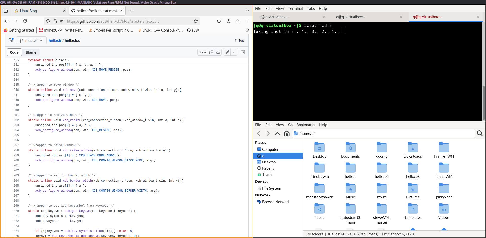

hellxcb
=============



→ tiny(!) and monsterous!
----------------------
This is xcb port of monsterwm tiling window manager.
For more detailed README refer to [monsterwm][]

The code editor in the picture above is Microsoft Visual Code Editor -- not **Studio Editor**

Installation
------------

Open up `config.h`
and edit to suit your needs.
Build and install.

    $ $EDITOR_OF_CHOICE config.h
    $ make -j8 # where 8 are CPU cores
    # make install

To have mouse cursor, open up `.xinitrc` and append somewhere before the `case` label the following `xsetroot -cursor_name left_ptr`

The statusline in the picture above is made of https://github.com/su8/doomy . You can use `sed` to make a named tag/workspace from `/tmp/hellxcb.txt` , just use `cat /tmp/hellxcb.txt | sed -E 's/tag: 1/tag: web/g; s/tag: 2/tag: dev/g; s/tag: 3/tag: misc/g; s/tag: 4/tag: float/g; s/tag 1/web/g; s/tag 2/dev/g; s/tag 3/misc/g; s/tag 4/float/g;'` and redirect it `/tmp/doomy.txt` if you use https://github.com/su8/doomy

To hide/show some windows, you can have drop down terminal:

```c
// config.h
// AppRule rules[] add your terminal and make it floating
{  MOD4,             XK_z,          hide_show,             {NULL}},

// hellxcb.c
static void hide_show(const Arg *arg) {
    (void)arg;
    static unsigned int show = 0U;
    static xcb_window_t curwin;
    if (!current) return;
    if (show = !show) { curwin = head->win; xcb_unmap_window(dis, curwin); }
    else { xcb_map_window(dis, curwin); xcb_move_resize(dis, curwin, 0, 0, 0, 0); }
}
```

The packages needed for example would be
`libxcb` `xcb-util` `xcb-util-wm` `xcb-util-keysym` `gcc` `make` `xorg` [ `pkg-config` or `pkgconfig`or `pkgconf` ]

For FreeBSD the packages are `gcc` `xorg` `gmake` `chromium` `git` `gawk` `libxcb` `xcb-util` `xcb-util-wm` `xcb-util-keysyms` `pkgconf`

Bugs
----

I have fixed - https://github.com/Cloudef/monsterwm-xcb/issues/8 . When closing pop-up dialogs you must use `alt + z` to bring the focusing back to normal.

Fill bugs only on hellxcb, when you are sure the bug doesn't occur on [monsterwm][].

[monsterwm issues][monsterwm-bug]

   [monsterwm-bug]: https://github.com/c00kiemon5ter/monsterwm/issues
   [monsterwm-xcb-bug]: https://github.com/Cloudef/monsterwm-xcb/issues

Thanks
------

[Cloudef](https://github.com/Cloudef) for [monsterwm-xcb](https://github.com/Cloudef/monsterwm-xcb),
[the suckless team][skls] for [dwm][],
[moetunes][] for [dminiwm][],
[pyknite][] for [catwm][],
[c00kiemonster][cookiemonster] for [monsterwm][]

  [skls]: http://suckless.org/
  [dwm]:  http://dwm.suckless.org/
  [moetunes]: https://github.com/moetunes
  [dminiwm]:  https://bbs.archlinux.org/viewtopic.php?id=126463
  [pyknite]: https://github.com/pyknite
  [catwm]:   https://github.com/pyknite/catwm
  [monsterwm]: https://github.com/c00kiemon5ter/monsterwm
  [cookiemonster]: https://github.com/c00kiemon5ter
  [monsterwm-xcb]: https://github.com/Cloudef/monsterwm-xcb
